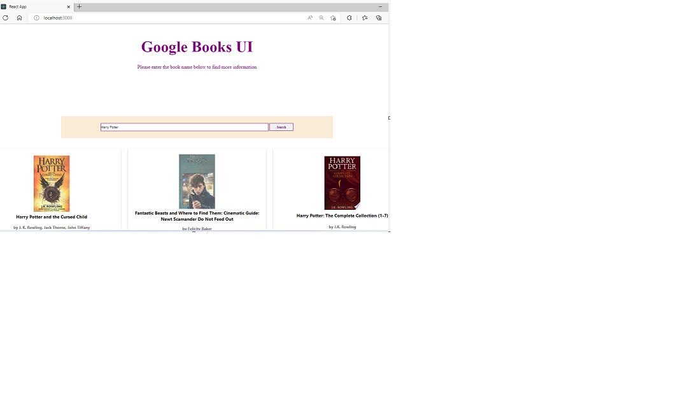

# Google Books API Search Engine

## Outline

This project will require you to use both DOM manipulation and Asynchronous programming. The aim is for the user to be able to search for a book inside the Google Books database and to be able to get more details about a certain title.

## Live Image

## MVP

Create a page that allows users to search for books Page should include the following:

-   Header section introducing the page

-   Form containing a text input and a submit / search button

-   A grid of books Instructions:

-   When the submit button is clicked you need the request books from the Google books API using the input value as your query string

-   The books that you receive should be rendered in the books grid.

-   Each book in the grid should have an image, author, title and description

-   The grid should be responsive on different screen sizes

-   You should use async / await for your request code, NOT .then

## Setup

-   Install VS Code for development

-   GitHub setup for adding the project to the repository : Important Commands :

    -   git remote add origin git@github.com:ItiTripathy/portfolio-website.git
    -   git add .
    -   git commit -m "Comment"
    -   git push origin main

-   Creating a React App:

        * Step-1: npx create-react-app my-app
        * Step-2: cd my-app
        * Step-3: npm i sass/npm install node-sass --save
        * Step-4: npm install --save prop-types
        * Step-5: npm start

## Implementation

-   The Main page is divided into 2 parts. Following are the Container components : Home and BookList

-   When a user searches for a particular book by entering it in the searchbar on the Home page, an API call is made to the Google Books API using which we fetch the data and then display the search results in a Grid form in the BookList section.

-   The BookList container has the BookCard component which displays each item in the booklist grid as a card containing all the details about a book.

-   The BookCard contains the BookModal component which displays the detailed information about a particular book once the user clicks on a Book Card.

-   The development is done using Asynchronous promgramming, React, JSX, SASS, Javascript and HTML.

-   The parent components pass on certain values as props to their children components.

-   The bookProcessor.js file contains the logic for obtaining the required details to display on the Modal windows by parsing through the JSON data obtained from the API call.

## Known issues

-   The Close button (X) on the BookModal page sometimes disappears on certain Modal windows. To be tested more to check if its brower specific and fixed.

## Future goals / changes

-   Update the Color Wheel/ Theme of the Website for better look and feel.

## Issues/Roadblocks faced

1.         *Issue: The Home Page used to Load and then disappear on load of the page.

          *Fix: The text input had to be checked for an empty string first onLoad() of the page so that it didnot disappear everytime.

2.        *Issue: The Console going offline everytime I had to test with different values. I had to restart the npm start page every time I had to test a functionality. This delayed the development speed and made it very difficult to test the website.
        *Fix: In the "Network" tab of the console the settings were changed to "Offline" by accident. The issue was fixed after the setting was changed back to "No Throttling".

## Contribution

-   The BookModal was developed by utilizing multiple generic Modal Window code snippets.
